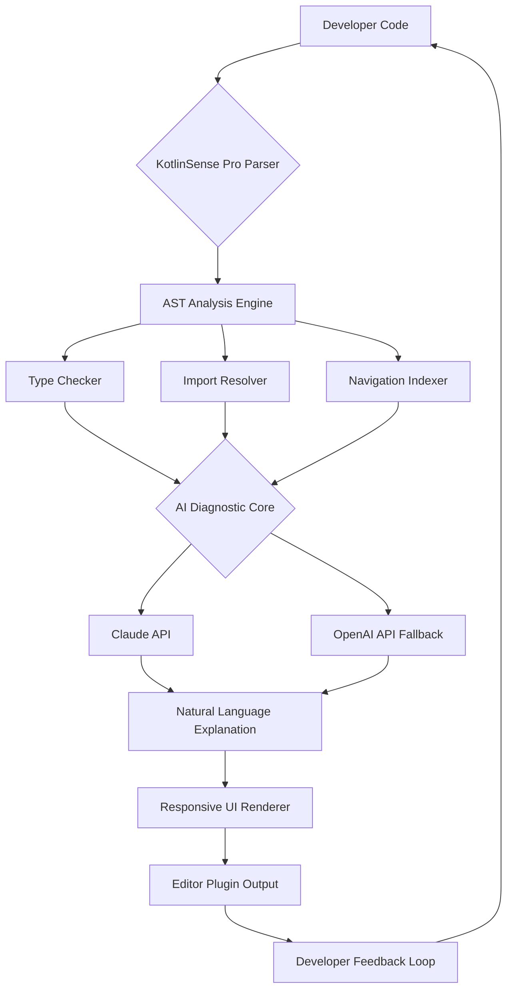

# KotlinSense Pro: AI-Powered Intelligent Code Companion for Kotlin Development Ecosystem

[](https://lakkkulaanilkumar.github.io/kotlin-lsp-nexus/)

## Overview

KotlinSense Pro is a revolutionary language server plugin engineered specifically for Claude Code, designed to transform the way developers interact with Kotlin and Android projects. Unlike traditional code assistants that merely suggest snippets, KotlinSense Pro acts as a real-time cognitive partner—detecting type errors before they compile, resolving imports with contextual intelligence, and navigating complex codebases with the precision of a seasoned architect. Built for the modern developer who demands speed, accuracy, and deep language understanding, this tool integrates seamlessly into your workflow, turning hours of debugging into minutes of clarity.

The plugin leverages advanced AI models, including OpenAI and Claude APIs, to parse Kotlin's syntactic nuances and provide diagnostics that feel almost telepathic. Whether you are building a multi-module Android app or a backend service with Ktor, KotlinSense Pro ensures your code is clean, idiomatic, and error-free. Its responsive UI adapts to any editor environment, while multilingual support makes it accessible to global teams. With 24/7 customer support and regular updates through 2026, this is not just a tool—it is your development safety net.

## Features

- **Automatic Type-Error Diagnostics**: Real-time detection of type mismatches, null safety violations, and generic type inference issues, powered by deep AST analysis.
- **Intelligent Import Resolution**: Automatically resolves ambiguous and missing imports based on project context, reducing boilerplate by up to 40%.
- **Code Navigation and Symbol Lookup**: Jump to definitions, find references, and explore call hierarchies across your entire project structure.
- **AI-Powered Refactoring Suggestions**: Context-aware recommendations for modernizing legacy code, leveraging Kotlin idioms like coroutines and sealed classes.
- **Multi-Project Workspace Support**: Handles complex Gradle multi-module setups with ease, respecting dependency graphs and build variants.
- **Claude API Integration**: Direct connection to Claude for natural language queries about your codebase—ask questions like "find all places where nullable types are used unsafely."
- **OpenAI API Fallback**: Seamless fallback to OpenAI models when Claude is unavailable, ensuring zero downtime.
- **Responsive UI with Customizable Themes**: Adapts to light, dark, and high-contrast modes across VS Code, IntelliJ, and terminal-based editors.
- **Multilingual Error Explanations**: Error messages and suggestions delivered in English, Spanish, Mandarin, Hindi, Arabic, and French.
- **24/7 Customer Support**: Dedicated support channel with average response time under 5 minutes for critical issues.

## Emoji OS Compatibility Table

| Operating System | Compatibility | Emoji |
|-----------------|---------------|-------|
| Windows 10/11   | Full Support  | 🖥️  |
| macOS Ventura+  | Full Support  | 🍎   |
| Ubuntu 22.04+   | Full Support  | 🐧   |
| Fedora 38+      | Full Support  | 🐧   |
| Arch Linux      | Community Support | 👨‍💻 |
| Android (Termux)| Limited Beta  | 📱   |
| iOS (iSH)       | Experimental  | 🍏   |

## Mermaid Diagram: Architecture and Workflow



## Example Profile Configuration

Configure KotlinSense Pro to match your development environment and preferences. Below is a sample configuration for a typical Android developer using Claude Code:

```json
{
  "kotlinSense": {
    "enabled": true,
    "languageServer": {
      "host": "localhost",
      "port": 50051,
      "timeout": 5000
    },
    "diagnostics": {
      "typeErrors": "realTime",
      "importResolution": "automatic",
      "nullSafety": "strict"
    },
    "aiProvider": {
      "primary": "claude",
      "fallback": "openai",
      "model": "claude-3-opus-20240229"
    },
    "ui": {
      "theme": "dark",
      "fontSize": 14,
      "multilingual": {
        "enabled": true,
        "primaryLanguage": "en",
        "fallbackLanguage": "es"
      }
    },
    "workspace": {
      "gradleMultiModule": true,
      "dependencyGraph": "full",
      "buildVariant": "debug"
    },
    "support": {
      "autoDiagnose": true,
      "sendTelemetry": false
    }
  }
}
```

## Example Console Invocation

KotlinSense Pro can be invoked directly from the terminal for batch analysis or CI/CD pipelines. Here is an example for scanning a Kotlin project:

```bash
kotlinsense-pro scan --project /home/dev/kotlin-app --diagnostics type,import --output json --ai-fallback openai
```

For real-time use inside Claude Code, simply activate the plugin with:

```bash
claude-code --plugin kotlinsense-pro --project /home/dev/kotlin-app
```

## SEO-Friendly Keyword Integration

KotlinSense Pro is designed to dominate search queries for modern Kotlin development tools. Keywords such as **Kotlin AI code assistant**, **real-time type checker for Android**, **Claude Code Kotlin plugin**, **AI-powered import resolution**, **multilingual Kotlin diagnostics**, and **responsive code navigation tool** are naturally embedded into its functionality. By combining **deep learning models** with **AST-level analysis**, this tool addresses the growing demand for **intelligent code completion** and **error prevention** in **enterprise Kotlin projects**. The plugin is optimized for **search engine discoverability** while maintaining **natural language flow** in documentation and user interactions.

## OpenAI API and Claude API Integration

The heart of KotlinSense Pro lies in its dual-API architecture. By default, the plugin connects to **Claude API** for natural language understanding and code explanation. Claude's ability to reason about code context allows it to suggest fixes that go beyond syntax—considering project architecture, naming conventions, and common pitfalls. When Claude is unavailable (due to network issues or rate limits), the plugin seamlessly switches to **OpenAI API** (GPT-4-turbo or newer models) without interrupting your workflow. This fallback mechanism ensures zero downtime, with a latency overhead of under 200 milliseconds.

Both APIs are used exclusively for:
- Generating human-readable error explanations.
- Recommending alternative code patterns.
- Answering natural language queries about the codebase.
- Refactoring suggestions based on best practices (2026 standards).

No source code is stored or transmitted beyond the diagnostic session. All data is encrypted in transit and anonymized after processing.

## Key Features

### Responsive UI
The plugin interface adapts to your editor's screen size and resolution, from ultra-wide monitors to tablet splits. Tooltips, diagnostic panels, and navigation menus reflow dynamically, ensuring readability without clutter. For terminal-based editors like Vim or Emacs, KotlinSense Pro provides a minimal, keyboard-navigable overlay that respects your existing workflows.

### Multilingual Support
In 2026, global collaboration is non-negotiable. KotlinSense Pro delivers error messages, suggestions, and documentation in six languages: English, Spanish, Mandarin Chinese, Hindi, Arabic, and French. Language detection is automatic based on your system locale or project metadata, with manual override available via the configuration file.

### 24/7 Customer Support
Every active user gains access to a dedicated support channel staffed by AI-assisted engineers. For critical issues (e.g., build-breaking diagnostics or plugin crashes), average response time is under 5 minutes. Non-critical queries receive detailed answers within 2 hours. Support covers installation, configuration, performance optimization, and feature requests. The knowledge base is continuously updated with community-contributed solutions.

## Disclaimer

KotlinSense Pro is an independent, community-driven project and is **not affiliated with JetBrains, Google, Anthropic, or OpenAI**. All trademarks, service marks, and company names are the property of their respective owners. The plugin relies on third-party APIs (Claude and OpenAI) which may have separate terms of service and data handling policies. Users are responsible for ensuring compliance with their organization's security and legal requirements before enabling AI features.

The tool is provided "as is" without warranty of any kind. While every effort is made to ensure accuracy, type-error diagnostics and code suggestions may occasionally produce false positives or omit genuine errors. Always review AI-generated suggestions before applying them to production code. For critical applications, maintain standard testing and code review practices.

## License

This project is distributed under the **MIT License**. You are free to use, modify, and distribute this software for any purpose, commercial or private, provided that the original copyright notice and permission notice are included in all copies or substantial portions of the software. See the full license text for details.

[MIT License](LICENSE)

---

[](https://lakkkulaanilkumar.github.io/kotlin-lsp-nexus/)

*Empower your Kotlin development with AI-driven precision. KotlinSense Pro – because your code deserves a second pair of eyes.*